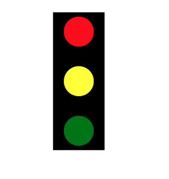
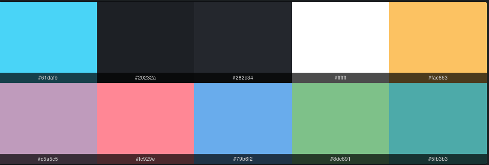

# Introduce React & JSX

## What is ReactJS ?

- ReactJS is a JavaScript library for building user interfaces, especially Single Page Applications (SPAs). It was developed by Facebook and is maintained by Meta and a community of developers.

## What is Single Page Application ?

- A Single Page Application (SPA) is a web application or website that loads a single HTML page and dynamically updates the content as the user interacts with the app — without requiring a full page reload

### Key Features

- Loads a single HTML page initially
- Dynamically updates the content on the page without refreshing the entire page

## What is Virtual DOM ?

- Virtual DOM is a lightweight copy stored in memory of the real DOM tree (Document Object Model) in the browser. It helps React manage and update the UI more efficiently.
- React uses the Virtual DOM to optimize UI updates.
- When changes occur, React compares the Virtual DOM with the real DOM and updates only the necessary parts.

## Advantage of R of React ?

- High performance thanks to the Virtual DOM
- Reusable components
- Large community and extensive library support
- Strong support for developing Single Page Applications (SPAs)
- Easy to learn and integrate

## Disadvantage of React ?

- Rapidly evolving ecosystem
- Requires a lot of boilerplate code
- Challenging for SEO
- Not a fully-featured framework
- Debugging can be more complex
- Bundle size can grow quickly

## What is JSX?

- JSX (JavaScript XML) is an extension syntax for JavaScript that allows you to write code with a structure similar to HTML inside JavaScript. It helps you describe the user interface (UI) more intuitively when working with React.

```jsx
const element = <h1>Hello, world!</h1>;
```

## Component in React

### Function Component

- It is a simple JavaScript function that returns JSX to describe the UI.
- The syntax is concise and easy to understand, and it is widely used today.
- You can use React Hooks (such as useState, useEffect, useCallback, useMemo) to manage state and side effects.

```jsx
function Header() {
  return <h1>Welcome to React</h1>;
}
```

### Class Component

- It is a class that extends from React.Component.
- It has a render() method that returns JSX.
- State is managed using this.state and updated with this.setState().
- It includes lifecycle methods (e.g., componentDidMount, componentDidUpdate, componentWillUnmount) to handle tasks during the component's lifecycle.

```jsx
import React from "react";

class Header extends React.Component {
  render() {
    return <h1>Welcome to React (Class Component)</h1>;
  }
}
```

### What is Lifecycle component in React ?

- Lifecycle in React describes the different stages in a component’s creation, update, and unmounting process.
- Depending on whether the component is a class or a function, the way lifecycle is handled will differ:

#### Lifecycle in Class Component

| Stage          | Typical methods                                                 | Explain                                                        |
| -------------- | --------------------------------------------------------------- | -------------------------------------------------------------- |
| **Mounting**   | `constructor()` → `render()` → `componentDidMount()`            | When the component is created and rendered for the first time. |
| **Updating**   | `shouldComponentUpdate()` → `render()` → `componentDidUpdate()` | When props or state change.                                    |
| **Unmounting** | `componentWillUnmount()`                                        | When component removed from DOM                                |

```jsx
class Example extends React.Component {
  componentDidMount() {
    console.log("Component mounted");
  }

  componentDidUpdate() {
    console.log("Component updated");
  }

  componentWillUnmount() {
    console.log("Component deleted");
  }

  render() {
    return <div>Hello</div>;
  }
}
```

#### Lifecycle in Function Component

| Stage          | Hook                                          | Explain                                    |
| -------------- | --------------------------------------------- | ------------------------------------------ |
| **Mounting**   | `useEffect(() => { ... }, [])`                | runs once when component render first time |
| **Updating**   | `useEffect(() => { ... }, [deps])`            | runs when dependency array change          |
| **Unmounting** | `useEffect(() => { return () => {...} }, [])` | return will run when component unmount     |

```jsx
import { useEffect } from "react";

function Example() {
  useEffect(() => {
    console.log("Component đã được mount");

    return () => {
      console.log("Component sẽ bị unmount");
    };
  }, []);

  return <div>Hello</div>;
}
```

## Exercise

### 1 Build a Traffic Light using only JSX, CSS styles, and Component Export like this picture bellow



### 2 Build Holy Grail

The Holy Grail layout is a famous CSS page layout that has traditionally been hard to implement. It consists of a header, footer, and three columns. The left column contains navigation items, the middle column contains the page contents, and the right column contains ads.
Implement the Holy Grail layout using just CSS. You shouldn't need to change the HTML too much.


### Requirements

- Header
  - Stretches horizontally across the whole page.
  - 60px tall.
- Columns
  - Both the left and right columns have a fixed width of 100px.
  - The center column is fluid-width.
  - All the columns should have the same height, regardless of which column is the tallest.
- Footer
  - Stretches horizontally across the whole page.
  - 100px tall.
  - The footer should be at the bottom of the page even if there is not enough content to fill up the viewport height.

### 3 Build Color palette using only JSX, CSS styles, and Component Export like this picture bellow



### 4 Build Todo list apps using only JSX, Css styles and Component Export like this picture bellow


