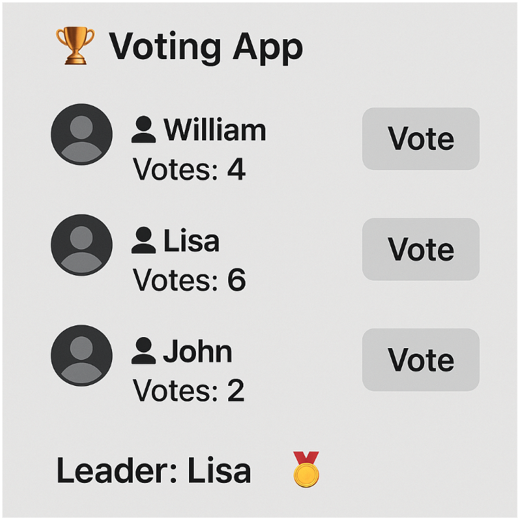
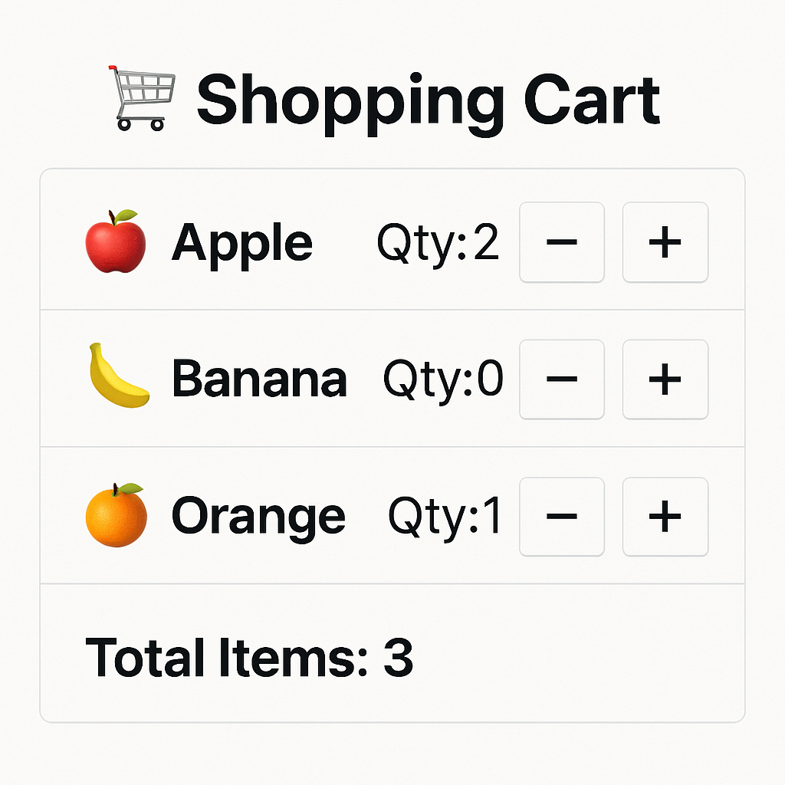
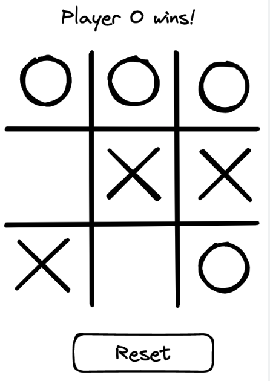

# Props, State in react

## Props

**_What is Props_**

- Used to pass data from a parent component to a child component.
- In React, props are the "inputs" of a component that help make the component flexible and reusable.

**_Example_**

```jsx
function Welcome(props) {
  return <h1>Hello, {props.name}!</h1>;
}

function App() {
  return <Welcome name="William" />;
}
```

- `Welcome` is the child component
- name="William" is a prop passed from App to Welcome
- Inside Welcome, we access props.name to use that data

## State

### What is state

- State is a special object in React used to store a component's internal data.
- When the state changes, React automatically re-renders the component to update the user interface.

### Why need state ?

- HTML/JavaScript does not "remember" data after each change.
- React allows you to remember and update the UI when data changes — thanks to state.

**_Example_**

- The number of times the user clicks a button
- The open/close state of a menu
- The list of products added to the shopping cart

### How to use state

**_Function component_**

```jsx
import { useState } from "react";

function Counter() {
  const [count, setCount] = useState(0);

  return (
    <div>
      <p>You clicked {count} times</p>
      <button onClick={() => setCount(count + 1)}>Click me</button>
    </div>
  );
}
```

- `useState(0)` Create a state named count with an initial value of 0.
- `setCount` It's the function used to update the value of count.
- When `setCount(...)` is called, React will `re-render` the UI to display the new value.

**_Class component_**

```jsx
import React from "react";

class Counter extends React.Component {
  constructor(props) {
    super(props);
    this.state = {
      count: 0,
    };
  }

  handleClick = () => {
    this.setState({
      count: this.state.count + 1,
    });
  };

  render() {
    return (
      <div>
        <p>You clicked {this.state.count} times</p>
        <button onClick={this.handleClick}>Click me</button>
      </div>
    );
  }
}

export default Counter;
```

- `constructor` is used to initialize state and calls `super(props)` to inherit from `React.Component`
- `this.state` the internal data of the component
- `this.setState(...)` Updated `state` and auto `re-render` UI
- `render()` returns JSX to render on the interface.

## Component Communication

- Props( parent-to-child)
- Custom Events(child-to-parent)
- Global state

## Event Handling in React

### What is an event?

- An event is an action that a user or browser can trigger — like a click, hover, form submit, keypress, etc.
- React uses its own synthetic event system which wraps the native DOM events and works consistently across all browsers.

## How to handle events in React

### In Functional Components

```jsx
function ClickButton() {
  const handleClick = () => {
    alert("Button clicked!");
  };

  return <button onClick={handleClick}>Click Me</button>;
}
```

- `onClick` is a React prop that listens to the click event.
- `handleClick` is a function that executes when the event is triggered.

Inline Function

```jsx
<button onClick={() => alert("Clicked!")}>Click Inline</button>
```

You can also write the handler directly inline, but avoid complex logic inline for readability.

### Class Component

```jsx
import React from "react";

class ClickButton extends React.Component {
  handleClick() {
    alert("Button clicked!");
  }

  render() {
    return <button onClick={this.handleClick}>Click Me</button>;
  }
}
```

- Problem with `this`
- When call this.handleClick,will receive `this is undefined` if don't `bind this`. There are three ways to handle this:

**Use `bind` in `constructor`**:

```jsx
class ClickButton extends React.Component {
  constructor(props) {
    super(props);
    this.handleClick = this.handleClick.bind(this);
  }

  handleClick() {
    alert("Button clicked!");
  }

  render() {
    return <button onClick={this.handleClick}>Click Me</button>;
  }
}
```

**Use `arrow function`**:

```jsx
class ClickButton extends React.Component {
  handleClick = () => {
    alert("Button clicked!");
  };

  render() {
    return <button onClick={this.handleClick}>Click Me</button>;
  }
}
```

**Use `arrow function` in JSX**:

```jsx
class ClickButton extends React.Component {
  handleClick() {
    alert("Button clicked!");
  }

  render() {
    return <button onClick={() => this.handleClick()}>Click Me</button>;
  }
}
```

## Exercise (use both class component and function component)

### 1 Mini Voting App

- Build a simple voting application for 3 candidates. Users can click the "Vote" button to increase a candidate's vote count and see the live result.

**_Requirements_**

1 Display a List of Candidates

- Create a list of 3 candidates. For each candidate, show:
  - Name
  - Vote count
  - A “Vote” button

2 . Use state to Track Votes

- Use useState (or this.state in class components) to manage vote counts for each candidate.
- When a user clicks the "Vote" button, increase the vote count for that candidate by 1.

3 Use props to Pass Data

- The App component should pass data and vote handlers to each Candidate component using props

**_Ui Suggestion_**



### 2 Product Counter App

**_Description_**

- Build a mini shopping cart interface with a list of 3 products. Each product should have:
- A name
- A quantity display (default: 0)
- Two buttons: "➖ Decrease" and "➕ Increase"

**_Requirements_**

**_Render a list of products in the App component_**

```json
const products = [
  { id: 1, name: "Apple" },
  { id: 2, name: "Banana" },
  { id: 3, name: "Orange" },
];
```

- **_ProductItem component_**
- Receives product name via `props`
- Manages its own `quantity` using `useState`
- Has “+” and “–” buttons to update the quantity

**_CartSummary Component_**

- Pass the quantities up to the App component via a shared state (lifting state up)
- `CartSummary` shows the total quantity of all items

**_Layout Example_**



### 3 Build a Simple Caro (Tic-Tac-Toe) Game

**_Requirements_**

1 Render a 3x3 game board using a Board component

- The board contains 9 Square components
- Squares display "X" or "O" when clicked

2 Track and switch turns between X and O

- Default: X starts first
- Alternate turns after each move

3 Prevent a square from being clicked more than once

4 Display a message:

- "Next turn: X" or "Next turn: O"
- "Player X wins!" or "Player O wins!" when someone wins
- "Draw!" if all squares are filled and no one wins

**_Component Responsibilities_**
`Square.jsx`

- Receives value ("X", "O", or "") via props
- Renders a button showing that value
- Calls onClick() from props when clicked

`Board.jsx`

- Manages game state: an array of 9 values
- Passes each square's value and onClick handler to Square
- Handles turn logic and winner checking

`App.jsx`

- Holds game state (if lifting up)
- Displays status message and renders Board

**_UI Example_**



### 4 Implement useState to build a Todo List from Day 1
