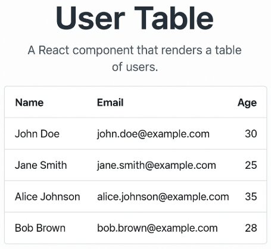
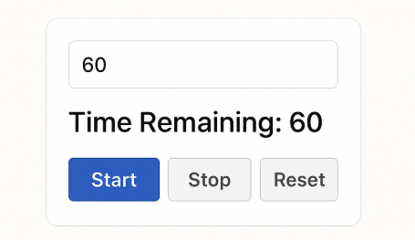

# Review previous lesson

## Life circle in React

### What is Lifecycle component in React ?

- Lifecycle in React describes the different stages in a component’s creation, update, and unmounting process.
- Depending on whether the component is a class or a function, the way lifecycle is handled will differ:

### Lifecycle in Class Component

| Stage          | Typical methods                                                 | Explain                                                        |
| -------------- | --------------------------------------------------------------- | -------------------------------------------------------------- |
| **Mounting**   | `constructor()` → `render()` → `componentDidMount()`            | When the component is created and rendered for the first time. |
| **Updating**   | `shouldComponentUpdate()` → `render()` → `componentDidUpdate()` | When props or state change.                                    |
| **Unmounting** | `componentWillUnmount()`                                        | When component removed from DOM                                |

```jsx
class Example extends React.Component {
  componentDidMount() {
    console.log("Component mounted");
  }

  componentDidUpdate() {
    console.log("Component updated");
  }

  componentWillUnmount() {
    console.log("Component deleted");
  }

  render() {
    return <div>Hello</div>;
  }
}
```

### Lifecycle in Function Component

| Stage          | Hook                                          | Explain                                    |
| -------------- | --------------------------------------------- | ------------------------------------------ |
| **Mounting**   | `useEffect(() => { ... }, [])`                | runs once when component render first time |
| **Updating**   | `useEffect(() => { ... }, [deps])`            | runs when dependency array change          |
| **Unmounting** | `useEffect(() => { return () => {...} }, [])` | return will run when component unmount     |

```jsx
import { useEffect } from "react";

function Example() {
  useEffect(() => {
    console.log("Components mount");

    return () => {
      console.log("Component unmount");
    };
  }, []);

  return <div>Hello</div>;
}
```

### Call Api with in componentDidMount / UseEffect

### How to call APi

- Using `fetch` or `axios`
- `Fetch` is native JS implement error and parse json by manual
- `axios` more convenience auto parse JSON, easy to catch error, timeout, interceptor…

| Feature                                 | Fetch                    | Axios |
| --------------------------------------- | ------------------------ | ----- |
| This feature is built-in in the browser | ✅                       | ❌    |
| auto parse JSON                         | ❌ (`res.json()` manual) | ✅    |
| handle errors HTTP                      | ❌ ( `res.ok`)           | ✅    |
| Timeout                                 | ❌                       | ✅    |
| Interceptors                            | ❌                       | ✅    |

**_Axios_**

```jsx
import React from "react";
import axios from "axios";

class UserList extends React.Component {
  state = { users: [] };

  componentDidMount() {
    axios
      .get("https://jsonplaceholder.typicode.com/users")
      .then((res) => this.setState({ users: res.data }));
  }

  render() {
    const { users } = this.state;
    return (
      <ul>
        {users.map((u) => (
          <li key={u.id}>{u.name}</li>
        ))}
      </ul>
    );
  }
}
```

```jsx
import { useState, useEffect } from "react";

function UserList() {
  const [users, setUsers] = useState([]);

  useEffect(() => {
    axios
      .get("https://jsonplaceholder.typicode.com/users")
      .then((res) => this.setState({ users: res.data }));
  }, []);

  return (
    <ul>
      {users.map((u) => (
        <li key={u.id}>{u.name}</li>
      ))}
    </ul>
  );
}
```

_**fetch**_

```jsx
import React from "react";
import axios from "axios";

class UserList extends React.Component {
  state = { users: [] };

  componentDidMount() {
    fetch("https://jsonplaceholder.typicode.com/users")
      .then((res) => {
        if (!res.ok) throw new Error("Fetch failed");
        return res.json();
      })
      .then((data) => this.setState({ users: res.data }));
  }

  render() {
    const { users } = this.state;
    return (
      <ul>
        {users.map((u) => (
          <li key={u.id}>{u.name}</li>
        ))}
      </ul>
    );
  }
}
```

```jsx
import { useState, useEffect } from "react";

function UserList() {
  const [users, setUsers] = useState([]);

  useEffect(() => {
    fetch("https://jsonplaceholder.typicode.com/users")
      .then((res) => {
        if (!res.ok) throw new Error("Fetch failed");
        return res.json();
      })
      .then((data) => setUsers(data));
  }, []);

  return (
    <ul>
      {users.map((u) => (
        <li key={u.id}>{u.name}</li>
      ))}
    </ul>
  );
}
```

**_Note about key_**

- key is a special attribute you add to elements in a list when you render them in React.
- It helps React identify which items have changed, been added, or removed.
- This helps React efficiently update the UI by only re-rendering the necessary components instead of the entire list.
- React also gives a warning if you forget to add a key or if keys are not unique.

## Handle error in react

### Why we need handle error in react

- Improve User Experience (UX)
  - Without error handling: The app may crash, freeze, or behave unexpectedly.
  - With error handling: You can show friendly messages, fallback UIs, or retry buttons.
- Debugging and Maintenance
  - Error handling helps you log errors for developers to debug.

### How to handle error in React

#### 1. Handle Errors in API Calls

- Use `try/catch` in async functions (`fetch`, `axios`, etc.) — especially inside `useEffect` or `componentDidMount`.

- Function Component (with `useEffect`):

```jsx
import { useEffect, useState } from "react";
import axios from "axios";

function Users() {
  const [users, setUsers] = useState([]);
  const [error, setError] = useState("");
  const [loading, setLoading] = useState(false);

  useEffect(() => {
    async function fetchUsers() {
      setLoading(true);
      try {
        const response = await axios.get(
          "https://jsonplaceholder.typicode.com/users"
        );
        setUsers(response.data);
      } catch (err) {
        setError(err.response?.data?.message || err.message);
      } finally {
        setLoading(false);
      }
    }

    fetchUsers();
  }, []);

  if (loading) return <p>Loading...</p>;
  if (error) return <p style={{ color: "red" }}>Error: {error}</p>;

  return (
    <ul>
      {users.map((user) => (
        <li key={user.id}>{user.name}</li>
      ))}
    </ul>
  );
}
```

#### 2 Handle Runtime Render Errors with Error Boundaries

- Class Components

```jsx
class ErrorBoundary extends React.Component {
  state = { hasError: false };

  static getDerivedStateFromError(error) {
    return { hasError: true };
  }

  componentDidCatch(error, info) {
    console.error("Error caught:", error, info);
  }

  render() {
    if (this.state.hasError) return <h2>Something went wrong.</h2>;
    return this.props.children;
  }
}
```

```jsx
<ErrorBoundary>
  <MyComponent />
</ErrorBoundary>
```

- Function component

`npm install react-error-boundary`

```jsx
import React from "react";
import { ErrorBoundary } from "react-error-boundary";

function ErrorFallback({ error }) {
  return (
    <div role="alert">
      <p>Something went wrong.</p>
      <pre style={{ color: "red" }}>{error.message}</pre>
    </div>
  );
}

export default function App() {
  return (
    <ErrorBoundary FallbackComponent={ErrorFallback}>
      <MyComponent />
    </ErrorBoundary>
  );
}
```

#### Use Axios.interceptors for global error handling

**What is Axios Interceptor?**

- **An Axios interceptor lets you run code globally before a request is sent or after a response is received. It’s useful for:**
- Automatically handling errors globally
- Adding authorization headers
- Showing loading spinners or notifications

**Why Use Interceptors for Error Handling?**

- **Instead of writing try/catch everywhere, interceptors allow you to:**
- Catch all API errors in one place
- Display a consistent error message or toast
- Redirect user to login if 401 Unauthorized
- Log errors for debugging

**_Setup Axios with Interceptor_**

Step 1: Create an Axios instance

```jsx
import axios from "axios";

const axiosClient = axios.create({
  baseURL: "https://api.example.com",
  timeout: 10000,
});
```

Step 2: Add Response Interceptor

```jsx
axiosClient.interceptors.response.use(
  (response) => {
    return response;
  },
  (error) => {
    if (error.response) {
      const status = error.response.status;

      if (status === 401) {
        window.location.href = "/login";
      }

      console.error(
        "API Error:",
        error.response.data?.message || error.message
      );
      alert(error.response.data?.message || "An unexpected error occurred!");
    } else {
      console.error("Network/Server error", error.message);
      alert("Network error. Please check your connection.");
    }

    return Promise.reject(error);
  }
);
```

Step 3: Use Axios Client in Your Components

```jsx
import { useEffect, useState } from "react";
import axiosClient from "../api/axiosClient";

function UserList() {
  const [users, setUsers] = useState([]);

  useEffect(() => {
    axiosClient.get("/users").then((response) => {
      setUsers(response.data);
    });
  }, []);

  return (
    <ul>
      {users.map((u) => (
        <li key={u.id}>{u.name}</li>
      ))}
    </ul>
  );
}
```

## Exercise

### 1 Build a traffic light where the lights switch from green to yellow to red after predetermined intervals and loop indefinitely. Each light should be lit for the following durations

- Red light: 4000ms
- Yellow light: 500ms
- Green light: 3000ms
- You are free to exercise your creativity to style the appearance of the traffic light.

### 2 Given a list of users, create a React component that renders a table of users. The table should have columns for the user's name, email, and age. The component should use the fetch API to fetch the list of users from an API endpoint

- Use the following endpoint -> <https://jsonplaceholder.typicode.com/users>
- Loading and error states:
  - Show a loading message or spinner while the data is being fetched.
  - Show an error message if the API call fails.



### 3. Countdown Timer with Input, Start, and Stop

- Build a CountdownTimer React component that allows users to input the starting time, and provides controls to start, stop, and optionally reset the timer. The countdown stops automatically at 0.

- Expectations:

  - Users can enter a starting time (in seconds) via an input field.
  - Timer displays: "Time Remaining: X" (X = seconds left).
  - Countdown updates every second using the useEffect hook.
  - Timer stops automatically when it reaches 0 and displays "Time's up!".

- Buttons:

  - Start:

    - Starts the countdown using the value entered in the input.
    - Disabled when the timer is running or the input is invalid (e.g., empty or ≤ 0).

  - Stop:

    - Pauses the countdown.
    - Disabled when the timer is not running.

  - Reset (optional):

    - Resets the timer to the initial input value and stops it.

**_Ui Suggestion_**


