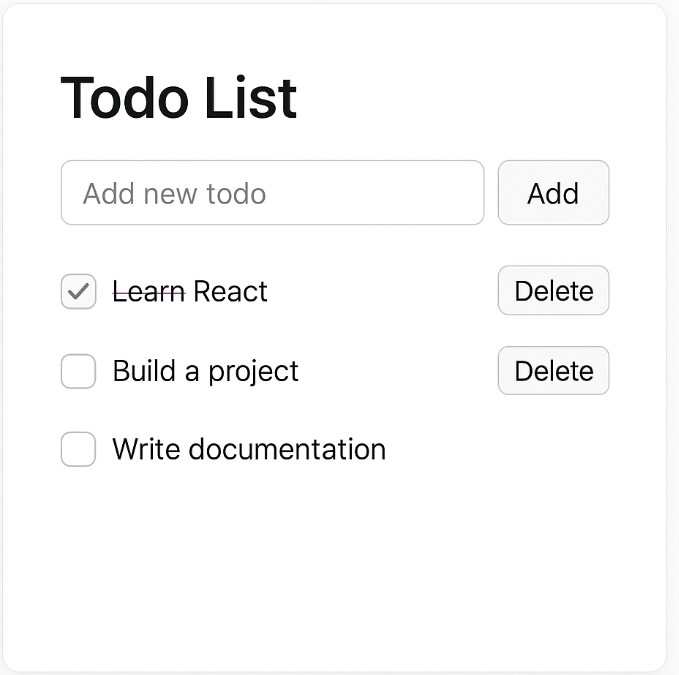
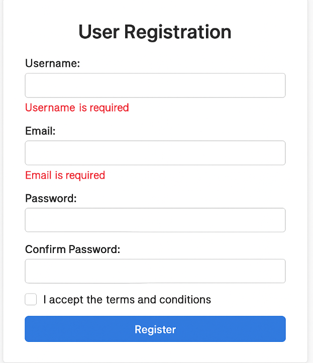

# Review previous lesson

## React.Memo

- It is a higher-order component (HOC) in React used to memoize a component — meaning React will skip re-rendering that component if its props have not changed.

```jsx
const MyComponent = React.memo(function MyComponent(props) {
  return <div>{props.value}</div>;
});
```

**_Why use need React.memo?:_**

- Whenever a parent component re-renders, all child components also re-render by default, even if their props haven't changed.

- Using React.memo helps to:

- Avoid unnecessary re-renders
- Optimize performance, especially for child components that are:
  - Heavy (with complex calculations)
  - Rendering large lists, or
  - Part of a list being mapped/rendered multiple times

```jsx
const Child = React.memo(({ value }) => {
  console.log("Child render");
  return <div>Value: {value}</div>;
});

function Parent() {
  const [count, setCount] = useState(0);

  return (
    <>
      <button onClick={() => setCount(count + 1)}>Increase</button>
      <Child value="static" />
    </>
  );
}
```

When the button is clicked, the Parent re-renders, but the Child does not re-render because the value hasn't changed.

**_Summary_**

- It helps avoid unnecessary renders if the props haven't changed.

## useRef

- useRef is a React hook that allows you to store a "reference" value without causing the component to re-render when the value changes.
- It is commonly used to directly access DOM elements or to persist a value across renders.

```jsx
const myRef = useRef(initialValue);
```

`myRef.current` holds the current value of the ref.

**_When use useRef_**

- Want to update and store a value without causing a re-render.
- Store DOM information to access the DOM element directly.

**_Example access the DOM element_**

```jsx
import { useRef } from "react";

function FocusInput() {
  const inputRef = useRef();

  const handleFocus = () => {
    inputRef.current.focus();
  };

  return (
    <>
      <input ref={inputRef} />
      <button onClick={handleFocus}>Focus Input</button>
    </>
  );
}
```

**_Example store value without rerender_**

```jsx
function RenderCounter() {
  const renderCount = useRef(1);

  useEffect(() => {
    renderCount.current++;
  }, []);

  return <p>Render count: {renderCount.current}</p>;
}
```

## useCallBack

useCallback is a React hook that helps memoize a callback function. It returns a version of the function that only changes when one or more specified dependencies change.

```jsx
const memoizedCallback = useCallback(() => {
  ///logic
}, [dependencies]);
```

**_Why use callback_**

When a React component re-renders, all functions defined inside it are recreated, which leads to:

- A child component receiving a newly created function as a prop will re-render, even if it's not necessary.

- `useCallback` helps avoid unnecessary function recreations, optimizes performance, and makes it easier for `React` to manage re-renders.

```jsx
import React, { useState, useCallback } from "react";

const Child = React.memo(({ onClick }) => {
  console.log("Child rendered");
  return <button onClick={onClick}>Click me</button>;
});

export default function Parent() {
  const [count, setCount] = useState(0);

  const handleClick = () => {
    console.log("Button clicked");
  };

  return (
    <div>
      <h1>Count: {count}</h1>
      <button onClick={() => setCount(count + 1)}>Increase Count</button>
      <Child onClick={handleClick} />
    </div>
  );
}
```

**_When use useCallBack_**

- When passing a callback to child components wrapped with React.memo, to prevent unnecessary re-renders of the child.

- When the callback is a dependency of other hooks like useEffect or useMemo, to avoid repeated executions.

- When the callback contains complex logic or expensive computations that should be memoized for better performance.

```jsx
export default function Parent() {
  const [count, setCount] = useState(0);

  const handleClick = useCallback(() => {
    console.log("Button clicked");
  }[]);

  return (
    <div>
      <h1>Count: {count}</h1>
      <button onClick={() => setCount(count + 1)}>Increase Count</button>
      <Child onClick={handleClick} />
    </div>
  );
}
```

**_Summary_**

- `useCallback` allows React to "remember" a function, preventing it from being recreated on every render.

- It is used to optimize performance, especially when passing callbacks to child components or using them as dependencies in other hooks.

## useMemo

- `useMemo` is a React hook used to memoize the result of an expensive computation, recalculating only when its dependencies change.

```jsx
const memoizedValue = useMemo(() => {
  return computeExpensiveValue(a, b);
}, [a, b]);
```

- `computeExpensiveValue` is only called again when a or b changes.
- If the dependencies remain the same, the previous result is reused, optimizing performance.

**_When use useMemo_**

- Heavy computations repeated multiple times

  - For example: sorting, filtering, or mapping large datasets.

- Avoid creating new objects/arrays on every render

  - Especially when passing them as props to child components wrapped with `React.memo.`

- When performance is a real concern

  - Avoid using it for premature optimization that adds unnecessary complexity.

```jsx
import React, { useState, useMemo } from "react";

function App() {
  const [count, setCount] = useState(0);
  const [other, setOther] = useState(false);

  const expensiveValue = useMemo(() => {
    console.log("calculate again...");
    let total = 0;
    for (let i = 0; i < 1000000000; i++) {
      total += i;
    }
    return total + count;
  }, [count]);

  return (
    <div>
      <p>Expensive result: {expensiveValue}</p>
      <button onClick={() => setCount(count + 1)}>increase count</button>
      <button onClick={() => setOther(!other)}>Toggle other</button>
    </div>
  );
}
```

## useReducer

useReducer is a React hook used for managing complex state, especially when multiple state values are related or when state updates follow clear logic.

It is similar to useState, but allows you to manage state in a Redux-like way — using actions and a reducer.

### How to use

```jsx
const [state, dispatch] = useReducer(reducer, initialState);
```

- `reducer`: A function that handles logic, taking the current state and an action
- `initialState`: The initial state value
- `dispatch`: A function used to send actions (to update the state)

### When use `useReducer`

- When there are multiple related state values
- When the update logic is complex
- When you want to manage state in a `Redux-style (action-based)` manner

**_Example_**

```jsx
import React, { useReducer } from "react";

const initialState = { count: 0 };

function reducer(state, action) {
  switch (action.type) {
    case "increment":
      return { count: state.count + 1 };
    case "decrement":
      return { count: state.count - 1 };
    case "reset":
      return initialState;
    default:
      throw new Error("Unknown action");
  }
}

function Counter() {
  const [state, dispatch] = useReducer(reducer, initialState);

  return (
    <div>
      <h2>Count: {state.count}</h2>
      <button onClick={() => dispatch({ type: "decrement" })}>-</button>
      <button onClick={() => dispatch({ type: "increment" })}>+</button>
      <button onClick={() => dispatch({ type: "reset" })}>Reset</button>
    </div>
  );
}
```

## Form

### Controlled Component

- They are components whose input values are fully controlled by React through state.
- Input values are stored in useState
- Must handle onChange to update the state
- Easy to control, validate data, and reset the form

**_Example_**

```jsx
import { useState } from "react";

function ControlledInput() {
  const [name, setName] = useState("");

  return <input value={name} onChange={(e) => setName(e.target.value)} />;
}
```

### Uncontrolled Component

- These are components where input values are stored directly in the DOM, not through state.
- Use refs to access values when needed
- No need to store values in state
- Quick for simple forms, but harder to manage in complex forms

**_Example_**

```jsx
import { useRef } from "react";

function UncontrolledInput() {
  const inputRef = useRef();

  const handleSubmit = () => {
    alert(inputRef.current.value);
  };

  return (
    <>
      <input ref={inputRef} />
      <button onClick={handleSubmit}>Submit</button>
    </>
  );
}
```

### Comparison

| Criteria        | Controlled Component                     | Uncontrolled Component      |
| --------------- | ---------------------------------------- | --------------------------- |
| Data Management | Through `state`                          | Through DOM (`ref`)         |
| Flexibility     | High (validation, auto-formatting, etc.) | Lower                       |
| Performance     | Slightly slower (more re-renders)        | Faster for simple forms     |
| When to Use     | Complex forms requiring validation       | Simple forms or quick tasks |

## Exercise

### Exercise 1: Basic React.memo

- Task:

  - Create two components: Counter (parent) and Child (child).
  - Child accepts a title prop and logs to the console on render.
  - When the count changes but title doesn’t, Child should not re-render.

### Exercise 2: Optimize Callback with useCallback

- Task:

  - Create a List component that receives an onAddItem function from the parent.
  - Use useCallback in the parent to prevent passing a new function reference on each render.

### Exercise 3: Memoize Expensive Computation with useMemo

- Task:

  - Create two states: number and text
  - Compute isEven(number) with a simulated heavy function (slow loop)
  - Use useMemo to only recompute when number changes

### Exercise 4: Todo List with useReducer

- Build a basic Todo List using useReducer to manage state.

**Requirements:**

- Create a TodoApp component.
- Use useReducer to handle the todo list state.
- The reducer should support:
- "add": Add a new todo item
- "toggle": Toggle completed status
- "delete": Remove a todo item

**Ui Example:**



### Exercise 5

React Form Exercise: Build a Simple User Registration Form

**Requirements:**

- Create a React component named RegistrationForm with the following fields:
- Username (text input)
- Email (text input)
- Password (password input)
- Confirm Password (password input)
- Terms and Conditions (checkbox)

**Tasks:**

- Use `controlled` components to handle all form inputs (store their values in React state).

- Add validation rules:

  - Username: required, min 3 characters
  - Email: required, must be a valid email format
  - Password: required, min 6 characters
  - Confirm Password: must match Password
  - Terms: must be checked

- Show error messages below inputs if validation fails.
- Disable the submit button until the form is valid.
- On submit, show an alert with the form data (except passwords for simplicity).
- Bonus: Reset the form after successful submission.

**Additional Requirement (Refs)**
Use a ref to automatically focus the first invalid input field when the user tries to submit the form with errors.

**Ui Suggestion:**


