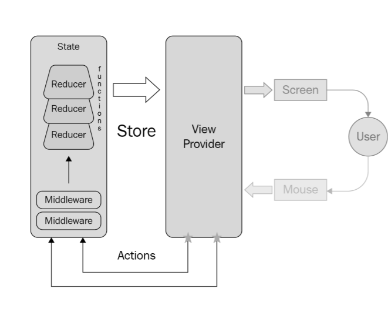
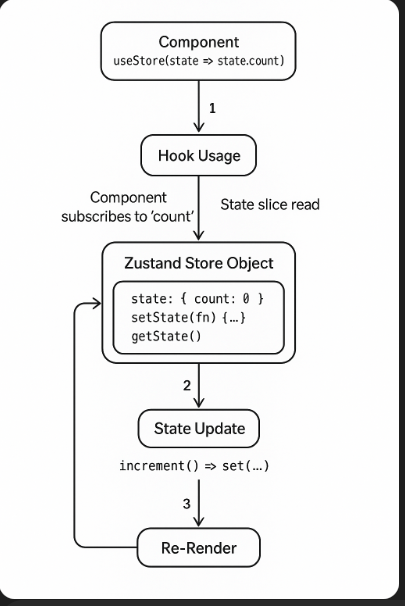

# Review last lesson

## State Management

- State management refers to the process of managing and updating the state of and application. State represents the current data and UI of an application at a moment.

1 Local state
2 Global state and external state management libraries

## Local vs Global State

- **_Local State_**: Managed inside a component using useState or useReducer.
- Example: a form input or modal toggle.

- **_Global State_**: Shared across multiple components.
- Example: the current user, app theme, or a shopping cart.

As your app grows, managing shared state across deeply nested components becomes difficult — that’s when state management tools help.

## Option for global State in React

### 1. React Context API

- Best for lightweight, small-scale global state.
- React has a built-in solution for passing state around: Context API.
- You can:

  - Create a shared state container (Context)
  - Wrap your app in a provider
  - Access that state anywhere using useContext

_**Use it when**_:

- You have a simple state like theme or locale
- You want no external dependencies

**Example:**:

```jsx
//CounterContext.jsx
import React, { createContext, useContext, useState } from "react";

const CounterContext = createContext();

export const CounterProvider = ({ children }) => {
  const [count, setCount] = useState(0);

  const increment = () => setCount((c) => c + 1);
  const decrement = () => setCount((c) => c - 1);

  return (
    <CounterContext.Provider value={{ count, increment, decrement }}>
      {children}
    </CounterContext.Provider>
  );
};

export const useCounter = () => useContext(CounterContext);

///App.jsx
import React from "react";
import { CounterProvider, useCounter } from "./CounterContext";

const Counter = () => {
  const { count, increment, decrement } = useCounter();
  return (
    <div>
      <p>Count: {count}</p>
      <button onClick={increment}>➕</button>
      <button onClick={decrement}>➖</button>
    </div>
  );
};

export default function App() {
  return (
    <CounterProvider>
      <Counter />
    </CounterProvider>
  );
}
```

### 2. Redux

- Best for large-scale, structured apps.

- Redux is a powerful, structured state management tool. It works well for:

  - Complex state logic
  - Predictable state flow (actions → reducers → state)
  - Middleware, async handling, and dev tools

**\*How Redux runs**

- 

_**Use it when**_:

- You need a predictable, scalable architecture
- Your app has many stateful features (auth, cart, notifications)

**Example (Redux Toolkit):**:

```jsx
//counterSlice.ts
import { createSlice } from "@reduxjs/toolkit";

const counterSlice = createSlice({
  name: "counter",
  initialState: { value: 0 },
  reducers: {
    increment: (state) => {
      state.value += 1;
    },
    decrement: (state) => {
      state.value -= 1;
    },
  },
});

export const { increment, decrement } = counterSlice.actions;
export default counterSlice.reducer;

// store.ts
import React from 'react';
import { Provider, useDispatch, useSelector } from 'react-redux';
import { store, RootState } from './store';
import { increment, decrement } from './counterSlice';

const Counter = () => {
  const count = useSelector((state: RootState) => state.counter.value);
  const dispatch = useDispatch();

  return (
    <>
      <p>Count: {count}</p>
      <button onClick={() => dispatch(increment())}>➕</button>
      <button onClick={() => dispatch(decrement())}>➖</button>
    </>
  );
};

export default function App() {
  return (
    <Provider store={store}>
      <Counter />
    </Provider>
  );
}
```

### 3 Zustand

Best for fast, simple, and modern state sharing.

- Zustand is a small but powerful library built by the creators of Jotai and React Spring. It:

  - Requires zero boilerplate
  - Doesn’t need a context provider
  - Lets you mutate state directly (like useState)
  - Supports middleware, persistence, dev tools (optional)

**_How zustand work:_**



```jsx
///useCounterStore.js
import { create } from "zustand";

export const useCounterStore = create((set) => ({
  count: 0,
  increment: () => set((state) => ({ count: state.count + 1 })),
  decrement: () => set((state) => ({ count: state.count - 1 })),
}));

///App.jsx
import React from "react";
import { useCounterStore } from "./useCounterStore";

const Counter = () => {
  const { count, increment, decrement } = useCounterStore();

  return (
    <div>
      <p>Count: {count}</p>
      <button onClick={increment}>➕</button>
      <button onClick={decrement}>➖</button>
    </div>
  );
};

export default function App() {
  return <Counter />;
}
```

### Competition

| **Tool**        | **Boilerplate** | **DevTool Support** | **Ease of Use** |
| --------------- | --------------- | ------------------- | --------------- |
| **Context API** | Low             | Limited             | High            |
| **Redux**       | High            | Excellent           | Moderate        |
| **Zustand**     | Low             | Good                | Very High       |

### Exercise

### 1 Themed Shopping Cart App

- Build a simple React app that allows users to:
  - Toggle between light and dark mode.
  - Add or remove products from a shopping cart.
  - View a summary of items in the cart.

**_Requirement:_**

1. `ThemeContext`

   - theme: either "light" or "dark".
   - toggleTheme(): switches between light and dark mode.

2. `CartContext`

- `cartItems`: an array of products (with at least id, name, price).
- `addToCart(product)`: adds a product to the cart.
- `removeFromCart(productId)`: removes a product by ID.
- `clearCart()`: clears all items.

**_Components to Build:_**

- `ThemeToggleButton`: Toggles the theme.
- `ProductList`: Displays mock products with “Add to Cart” buttons.
- `CartSummary`: Displays total item count and price.
- `CartDetail`: Lists all items in the cart with “Remove” buttons.
