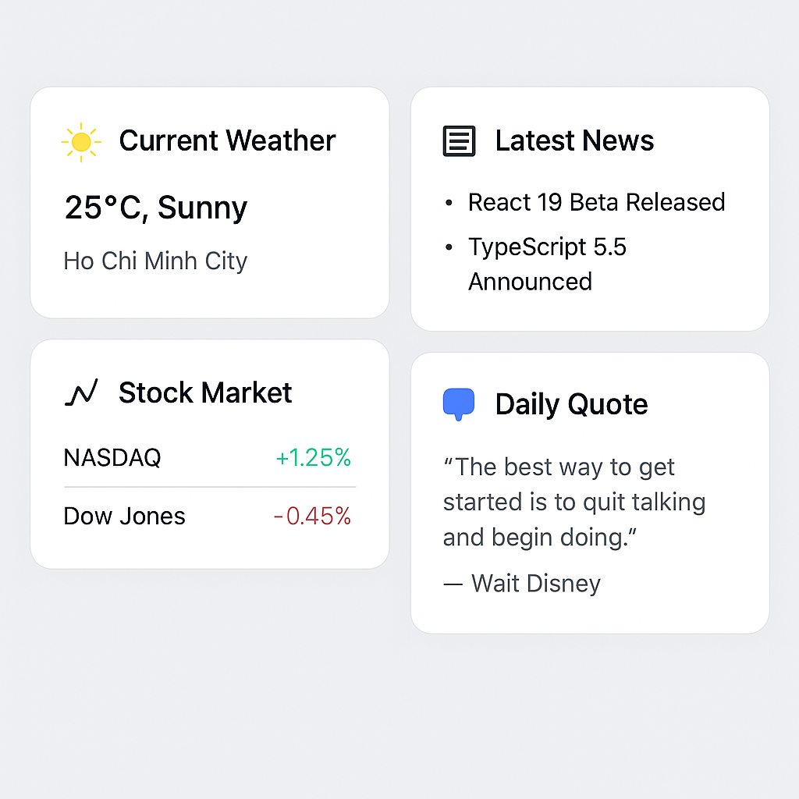

# Review last lesson

## Custom Hooks and Pattern Rendering in React

### Custom Hooks

- Custom Hooks are hooks you create yourself by combining built-in hooks.
- Purpose: To reuse logic across multiple components and keep code clean and maintainable.

#### Why use Custom Hooks?

- When multiple components share the same logic.
- To separate logic from UI.
- To increase code reusability and maintainability.

#### How to create a Custom Hook

- Name the hook starting with use.
- Use React hooks inside your custom hook.
- Return values or functions you want to expose.

```jsx
import { useState, useEffect } from "react";

function useWindowWidth() {
  const [width, setWidth] = useState(window.innerWidth);

  useEffect(() => {
    function handleResize() {
      setWidth(window.innerWidth);
    }
    window.addEventListener("resize", handleResize);

    return () => {
      window.removeEventListener("resize", handleResize);
    };
  }, []);

  return width;
}

function MyComponent() {
  const width = useWindowWidth();

  return <div>Window width: {width}px</div>;
}
```

### Pattern Rendering

#### Conditional Rendering

- Render UI conditionally based on a state or prop.

```jsx
function Greeting({ isLoggedIn }) {
  return (
    <div>{isLoggedIn ? <h1>Welcome back!</h1> : <h1>Please log in</h1>}</div>
  );
}
```

#### Render Props

- Pass a function as a prop that determines what UI to render.

```jsx
function DataFetcher({ render }) {
  const [data, setData] = React.useState(null);

  React.useEffect(() => {
    fetch("/api/data")
      .then((res) => res.json())
      .then(setData);
  }, []);

  return <div>{render(data)}</div>;
}

<DataFetcher
  render={(data) => (data ? <div>{data.name}</div> : <div>Loading...</div>)}
/>;
```

#### Higher-Order Components (HOC)

- Higher-Order Components (HOCs) are a design pattern in React where a function takes a component and returns a new component, enhancing it with additional logic or behavior.

```jsx
function withLoading(Component) {
  return function WrappedComponent({ isLoading, ...props }) {
    if (isLoading) return <div>Loading...</div>;
    return <Component {...props} />;
  };
}

// Usage
const UserListWithLoading = withLoading(UserList);

<UserListWithLoading isLoading={true} users={[]} />;
```

#### Slot pattern

- The Slot Pattern in React (inspired by web components) allows for flexible composition of components by passing content into specific “slots” — typically using children or named props/components.

- Basic Slot Pattern

```jsx
const Card = ({ children }) => <div className="card">{children}</div>;

<Card>
  <h2>Title</h2>
  <p>Description</p>
</Card>;
```

- Named Slot Pattern

```jsx
const Modal = ({ header, body, footer }) => (
  <div className="modal">
    <div className="modal-header">{header}</div>
    <div className="modal-body">{body}</div>
    <div className="modal-footer">{footer}</div>
  </div>
);

<Modal
  header={<h1>Modal Title</h1>}
  body={<p>This is the body content.</p>}
  footer={<button>Close</button>}
/>;
```

- Component-Based Slots

```jsx
const Page = ({ children }) => <div>{children}</div>;

Page.Header = ({ children }) => <header>{children}</header>;
Page.Body = ({ children }) => <main>{children}</main>;
Page.Footer = ({ children }) => <footer>{children}</footer>;

<Page>
  <Page.Header>My Header</Page.Header>
  <Page.Body>Main Content</Page.Body>
  <Page.Footer>Footer Info</Page.Footer>
</Page>;
```

## Exercise

### 1 Build a custom useFetch hook that encapsulates the logic for handling the loading and error states when fetching data

**_Requirement_**

- return the response from the server
- handle error and loading states
- support custom headers through an options parameter
- support all HTTP methods - e.g. both GET and POST requests

### 2 Tutorial: Create a custom hook that allows saving items to the local storage

**_Requirement_**

- Create useLocalStorage hook that:
- Accepts a key and an initialValue.
- Tries to load the value from localStorage.
- If no value exists, sets it to initialValue.
- Returns [storedValue, setValue] like useState.
- Updates localStorage when setValue is called.

### 3 Exercise: Build a Dashboard Widget Panel

Create a Dashboard component that renders different widgets based on a pattern (object type, condition, or user role). Use pattern rendering techniques such as conditional rendering, dynamic component mapping, or render props.

- Requirements:

1 You have the following widget types:

- WeatherWidget
- NewsWidget
- StockWidget
- QuoteWidget

2 You’ll receive a list of widget configs like:

```jsx
const widgetConfigs = [
  { type: "weather", title: "Current Weather" },
  { type: "news", title: "Latest News" },
  { type: "stock", title: "Stock Market" },
  { type: "quote", title: "Daily Quote" },
];
```

3 Each widget type should render a different component based on the type key.

🔧 Tasks:
Create each widget component (WeatherWidget, NewsWidget, etc.) with simple UI showing its title.

Create a WidgetRenderer component that uses pattern rendering (e.g., a component map or switch-case) to choose which component to render based on type.

Render the full list of widgets in the Dashboard.


