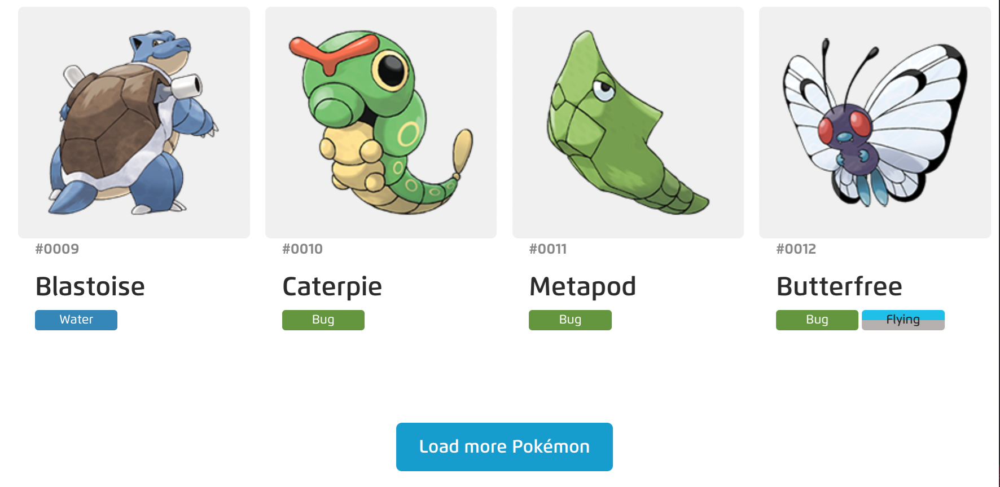

# Review last lesson

## Custom Hooks and Pattern Rendering in React

### Custom Hooks

- Custom Hooks are hooks you create yourself by combining built-in hooks.
- Purpose: To reuse logic across multiple components and keep code clean and maintainable.

#### Why use Custom Hooks?

- When multiple components share the same logic.
- To separate logic from UI.
- To increase code reusability and maintainability.

#### How to create a Custom Hook

- Name the hook starting with use.
- Use React hooks inside your custom hook.
- Return values or functions you want to expose.

```jsx
import { useState, useEffect } from "react";

function useWindowWidth() {
  const [width, setWidth] = useState(window.innerWidth);

  useEffect(() => {
    function handleResize() {
      setWidth(window.innerWidth);
    }
    window.addEventListener("resize", handleResize);

    return () => {
      window.removeEventListener("resize", handleResize);
    };
  }, []);

  return width;
}

function MyComponent() {
  const width = useWindowWidth();

  return <div>Window width: {width}px</div>;
}
```

### Pattern Rendering

#### Conditional Rendering

- Render UI conditionally based on a state or prop.

```jsx
function Greeting({ isLoggedIn }) {
  return (
    <div>{isLoggedIn ? <h1>Welcome back!</h1> : <h1>Please log in</h1>}</div>
  );
}
```

#### Render Props

- Pass a function as a prop that determines what UI to render.

```jsx
function DataFetcher({ render }) {
  const [data, setData] = React.useState(null);

  React.useEffect(() => {
    fetch("/api/data")
      .then((res) => res.json())
      .then(setData);
  }, []);

  return <div>{render(data)}</div>;
}

<DataFetcher
  render={(data) => (data ? <div>{data.name}</div> : <div>Loading...</div>)}
/>;
```

#### Higher-Order Components (HOC)

- Higher-Order Components (HOCs) are a design pattern in React where a function takes a component and returns a new component, enhancing it with additional logic or behavior.

```jsx
function withLoading(Component) {
  return function WrappedComponent({ isLoading, ...props }) {
    if (isLoading) return <div>Loading...</div>;
    return <Component {...props} />;
  };
}

// Usage
const UserListWithLoading = withLoading(UserList);

<UserListWithLoading isLoading={true} users={[]} />;
```

#### Slot pattern

- The Slot Pattern in React (inspired by web components) allows for flexible composition of components by passing content into specific “slots” — typically using children or named props/components.

- Basic Slot Pattern

```jsx
const Card = ({ children }) => <div className="card">{children}</div>;

<Card>
  <h2>Title</h2>
  <p>Description</p>
</Card>;
```

- Named Slot Pattern

```jsx
const Modal = ({ header, body, footer }) => (
  <div className="modal">
    <div className="modal-header">{header}</div>
    <div className="modal-body">{body}</div>
    <div className="modal-footer">{footer}</div>
  </div>
);

<Modal
  header={<h1>Modal Title</h1>}
  body={<p>This is the body content.</p>}
  footer={<button>Close</button>}
/>;
```

- Component-Based Slots

```jsx
const Page = ({ children }) => <div>{children}</div>;

Page.Header = ({ children }) => <header>{children}</header>;
Page.Body = ({ children }) => <main>{children}</main>;
Page.Footer = ({ children }) => <footer>{children}</footer>;

<Page>
  <Page.Header>My Header</Page.Header>
  <Page.Body>Main Content</Page.Body>
  <Page.Footer>Footer Info</Page.Footer>
</Page>;
```

## Exercise

### 1 Build a custom useFetch hook that encapsulates the logic for handling the loading and error states when fetching data

**_Requirement_**

- return the response from the server
- handle error and loading states
- support custom headers through an options parameter
- support all HTTP methods - e.g. both GET and POST requests

- To help you get started, the starter [repo](https://github.com/reactpractice-dev/use-fetch-hook?ref=reactpractice.dev) includes failing unit tests for both the useFetch hook and the PokemonList component.

### 2 Tutorial: Create a custom hook that allows saving items to the local storage

You will start from an existing Todo List app (yes, another one!) built with React. It works great - users can add / remove items - but there is only one problem - every time the page is refreshed, all the items are lost.

Your task will be to implement persistence - the list of tasks should be saved to local storage, so that the user can continue where they left off after closing and reopening the browser window.

You can start from this starter repo on Github, containing the todo list app: <https://github.com/reactpractice-dev/local-storage-hook>

**_Requirement_**

- Create useLocalStorage hook that:
- Accepts a key and an initialValue.
- Tries to load the value from localStorage.
- If no value exists, sets it to initialValue.
- Returns [storedValue, setValue] like useState.
- Updates localStorage when setValue is called.

### 3 Exercise: Build a Dashboard Widget Panel

Create a Dashboard component that renders different widgets based on a pattern (object type, condition, or user role). Use pattern rendering techniques such as conditional rendering, dynamic component mapping, or render props.

- Requirements:

1 You have the following widget types:

- WeatherWidget
- NewsWidget
- StockWidget
- QuoteWidget

2 You’ll receive a list of widget configs like:

```jsx
const widgetConfigs = [
  { type: "weather", title: "Current Weather" },
  { type: "news", title: "Latest News" },
  { type: "stock", title: "Stock Market" },
  { type: "quote", title: "Daily Quote" },
];
```

3 Each widget type should render a different component based on the type key.

- Tasks:

  - Create each widget component (WeatherWidget, NewsWidget, etc.) with simple UI showing its title.
  - Create a WidgetRenderer component that uses pattern rendering (e.g., a component map or switch-case) to choose which component to render based on type.
  - Render the full list of widgets in the Dashboard.


### 4 Build a paginated Pokemons list with a "Load more" button - starting from failing unit tests

- It's common to see websites or applications that show lists of data with a "Load more" button.

- Usually, the page initially shows just 10-15 results and if the user presses "Load more", more results are loaded and merged into the initial set.

Some examples are the [IKEA website](https://www.ikea.com/nl/en/search/?q=office%20chairs&ref=reactpractice.dev) or the [H&M online shop!](https://www2.hm.com/en_us/home/shop-by-room/livingroom.html?sort=stock&image-size=small&image=stillLife&offset=0&page-size=72&ref=reactpractice.dev)

- However, their APIs are not free, so let's use the Pokemon API instead to build something similar. Here's an example from the Pokedex website that uses the same pattern, with a "Load more" button:

Build a component that displays a list of Pokemons with a "Load more" button. You can use the free Poke API to retrieve the data.

- Initially, the component should only show the first 5 items
- Below the list, there should be a label saying how many items are being displayed from the total - e.g. "Displaying 20 of 567 results"
- Clicking "Load more" will load another 5 items into the list
- When the are no more results, the button should no longer be displayed
- The styling doesn't matter for this component - just make sure to display the pokemons as <li> elements in a list - <ul> - and show the name for each


