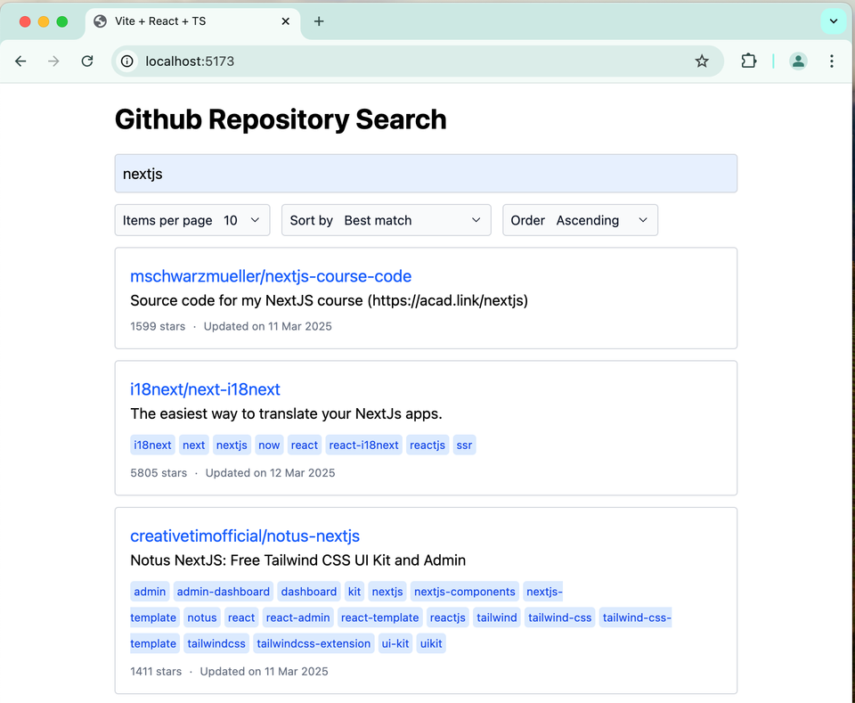
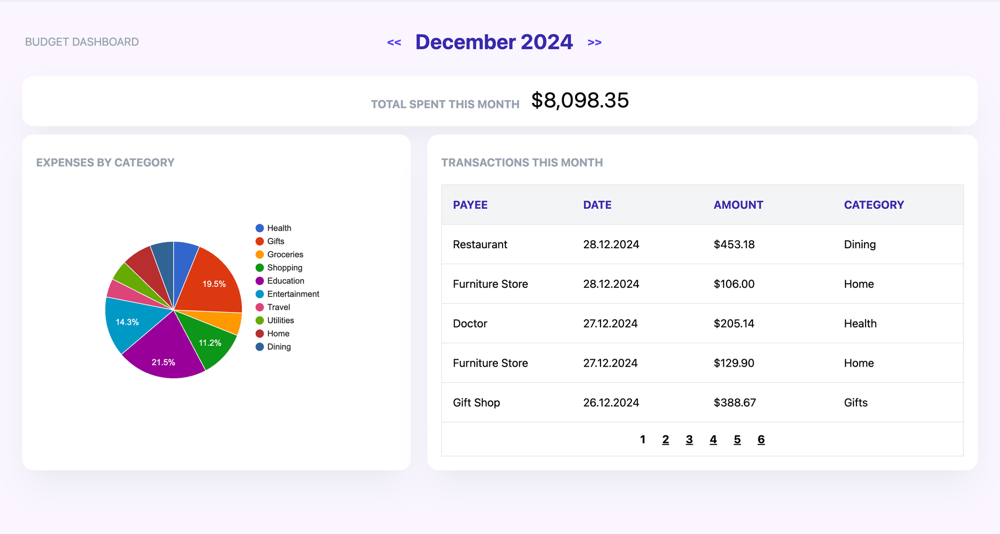
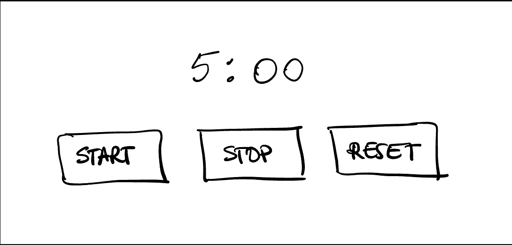

# Review last lesson

## Typescript

### What is TypeScript?

- TypeScript is a free and open-source high-level programming language developed by Microsoft that adds static typing with optional type annotations to JavaScript. It is designed for the development of large applications and transpiles to JavaScript.

### Basic Types

- `string`, `number`, `boolean`, `any`, `unknown`
- `null`, `undefined`, `void`, `never`

```ts
let age: number = 25;
let name: string = "William";
let isOnline: boolean = true;
let anything: any = "Can be anything";
```

**_any_**

- Allow skipping type checking entirely.
- You can do anything with a variable of type `any`, and TypeScript won't report an error.

```ts
let value: any = 42;
value.toUpperCase(); // ✅ No error even value is number
```

**_unknown_**:

- Similar to `any` in that it can hold `any` type of data.
- But it's safer: you have to check the type before performing operations.

```ts
let value: unknown = 42;
value.toUpperCase(); // ❌ Error: Object is of type 'unknown'

if (typeof value === "string") {
  value.toUpperCase(); // ✅ OK after check type is string
}
```

|               | `any`                           | `unknown`                                                 |
| ------------- | ------------------------------- | --------------------------------------------------------- |
| Type checking | ❌ Not required                 | ✅ Required before usage                                  |
| Safety        | 🔴 Very low                     | 🟢 Higher                                                 |
| Use case      | Temporarily disable type checks | When receiving values of unknown type (e.g., from an API) |

**_void_**

- `void` is the return type of a function when it doesn't return any value.
- This function just performs an action and doesn't return anything

```ts
function sayHello(name: string): void {
  console.log("Hello", name); // no return
}
```

**_When use void:_**

- Used when writing side-effect functions: logging, alerting, handling events, etc.
- In callbacks, event handlers, or async functions that don’t return a specific result.

### Arrays

- Contains multiple elements of the same data type.

```ts
const numbers: number[] = [1, 2, 3];
const fruits: Array<string> = ["apple", "banana"];
```

### Tuples

- A tuple is an array with a fixed number of elements, where each element can have a different type.

```ts
const person: [string, number] = ["Alice", 25];
```

| Feature       | Array                           | Tuple                           |
| ------------- | ------------------------------- | ------------------------------- |
| Size          | Dynamic (not fixed)             | Fixed                           |
| Element types | Same type                       | Can be different                |
| Use case      | List of data with the same type | Structured data pairs or groups |

### Enums

- Allow you to define a set of named constants.
- They make it easier to work with a fixed set of related values, improving code readability and maintainability.
- Enums can be numeric or string-based.

```ts
enum Direction {
  Up,
  Down,
  Left,
  Right,
}

const move: Direction = Direction.Up;
```

### Unions

- Union types allow a variable to hold values of multiple specified types.
- You use the pipe | symbol to combine types.
- Useful when a value can be one of several types, allowing flexible and safer code.
- Requires type checking before using the variable.

```ts
let value: string | number;

value = "hello"; // OK
value = 42; // OK
// value = true; // Error: boolean not allowed

if (typeof value === "string") {
  console.log(value.toUpperCase());
}
```

### Type

- Used to create a new name for any type — primitive, union, tuple, object, etc.
- Flexible and powerful for defining complex types.

```ts
type User = {
  name: string;
  age: number;
};

type ID = string | number;

const user1: User = { name: "Alice", age: 25 };
const userId: ID = 12345;
```

### Interface

- Mainly used to define the shape of objects or classes.
- Supports declaration merging and extension.

```ts
interface User {
  name: string;
  age: number;
}

interface User {
  email?: string; // Declaration merging adds this property
}

const user2: User = { name: "Bob", age: 30, email: "bob@example.com" };
```

| Difference          | `type`                                                              | `interface`                                                  |
| ------------------- | ------------------------------------------------------------------- | ------------------------------------------------------------ |
| What it can define  | Can define primitives, unions, intersections, tuples, objects, etc. | Mainly used to define object or class shapes                 |
| Redeclaration       | ❌ Cannot redeclare with the same name                              | ✅ Can redeclare and declarations are merged automatically   |
| Extending/Combining | Uses intersection (`&`) to combine types                            | Uses `extends` to inherit from other interfaces              |
| Union types         | ✅ Supports union types                                             | ❌ Does not support union types                              |
| Primitive types     | ✅ Can alias primitive types                                        | ❌ Cannot define primitive types                             |
| Common use cases    | Used for complex and flexible type definitions                      | Used to describe clear data structures and work with classes |
| OOP support         | Limited (cannot be implemented by classes)                          | Supports OOP (can be implemented by classes)                 |

### Pick

- `Pick` creates a new type by selecting a subset of properties from an existing type.

**_Syntax_**

```ts
type Pick<Type, Keys extends keyof Type>
```

_**Example**_

```ts
type User = {
  id: number;
  name: string;
  email: string;
  isAdmin: boolean;
};

type PublicUser = Pick<User, "id" | "name">;
// {
//   id: number;
//   name: string;
// }
```

### Omit<Type, Keys>

- `Omit` creates a new type by excluding one or more properties from an existing type.

_**Syntax**_

```ts
type Omit<Type, Keys extends keyof any>
```

**_Example:_**

```ts
type User = {
  id: number;
  name: string;
  email: string;
  isAdmin: boolean;
};

type CreateUserInput = Omit<User, "id" | "isAdmin">;
// Result:
// {
//   name: string;
//   email: string;
// }
```

## Typescript with React

### Tsx

- TSX (TypeScript XML) is a TypeScript file extension used for writing React components.
- Basically, it’s a TypeScript (.ts) file that can include JSX syntax (HTML within JavaScript).
- It’s similar to React’s .jsx files but with TypeScript’s type support.

### How does TypeScript help with React?

- It adds static type checking right while writing code.
- Helps catch errors early and makes code clearer.
- Supports autocomplete, enhancing the developer experience.
- Makes managing props, state, and event types easier.

### Typing Props

```tsx
type ButtonProps = {
  onClick: (event: React.MouseEvent<HTMLButtonElement>) => void;
  label: string;
};

function Button({ onClick, label }: ButtonProps) {
  return <button onClick={onClick}>{label}</button>;
}
```

### Typing State

```tsx
import React, { useState } from "react";

const Counter = () => {
  const [count, setCount] = useStat<number>(0);

  return (
    <div>
      <p>{count}</p>
      <button onClick={() => setCount(count + 1)}>Increase</button>
    </div>
  );
};
```

### Typing refs

```tsx
import React, { useRef } from "react";

const InputFocus = () => {
  const inputRef = useRef<HTMLInputElement>();

  const focusInput = () => {
    inputRef.current?.focus();
  };

  return <input ref={inputRef} />;
};
```

### Exercises

#### 1 Build a GitHub repositories search page with sorting and pagination using TypeScript and React

Build a Github Repositories search page, with sorting and pagination. You can use the Github REST Api /[search/repository endpoint](https://docs.github.com/en/rest/search/search?apiVersion=2022-11-28&ref=reactpractice.dev#search-repositories) to query the data. The results should be paginated; by default, show 10 repositories per page:

Users should be able to:

- search repositories by name
- choose how many items to show per page
- choose what to sort by: best-match, stars, most-updated
- choose whether to sort ascending or descending

- You can use React Query for fetching the data.



#### 2 Build a budget app dashboard using Typescript and React

Build a dashboard for an expense tracking app.

For a given month, it should show:

- the transactions for that month
- the total spent amount
- a graph of expenditure per category as a pie chart
- Users should be able to navigate through the months.
- Show the transactions 5 at a time, with the most recent ones first.

- Since the focus is on the client-side React interactivity, this app has no backend - you can just use the sample JSON file provided for the data.

- For each transaction, the date, payee, amount and category are available.

For displaying the chart, you can use [React Google Charts](https://www.react-google-charts.com/?ref=reactpractice.dev) library, which has a simple to use pie chart.



#### 3 Create a simple Contact Book app using Typescript and React

Create a simple Contact Book app that allows users to manage a collection of friends’ contact details.

For each person, the user should be able to save the name and city where they live. Users should be able to add, edit and delete persons.

All contact details should be displayed on one page, as person “cards”. The cards can be "flipped" to go to "Edit" mode by clicking an "Edit" button. Only allow editing one contact at a time.

[Contact Book Demo Video](contact-book-video-1.mp4)

#### 4 Create a timer that can be started and stopped

- Create a 5 minute countdown timer that can be started and stopped.

1 When the page is first loaded, the counter displays 5 minutes (i.e. `5:00`)
2 When the user clicks "Start", the counter starts counting down.
3 When the user clicks "Stop", the timer should stop elapsing time.
4 When the user clicks "Reset", the timer should be reset to 5 minutes again

What you will practice:

- working with `Date` objects
- formatting dates
- `useState` hook
- using `setInterval` in React
- using the "updater" version of `useState` setter function


