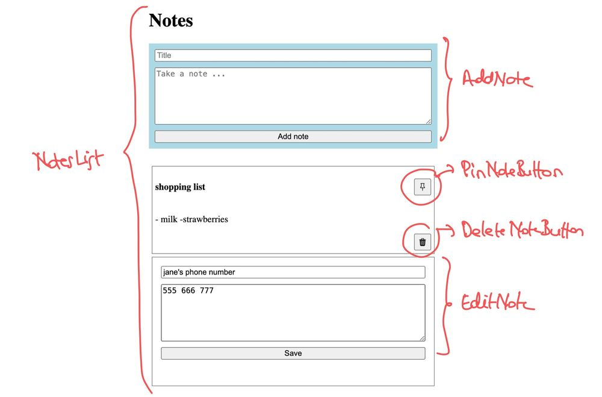

# Review last lesson

## React Core Overview

- JSX: Syntax extension that allows writing HTML-like code inside JavaScript.

- Components:

  - Functional components (modern standard)
  - Component composition

- `Props`: Mechanism to pass data from parent to child
- `State`: Local component state using useState
- Lifecycle (via hooks): useEffect for side effects

## State Management Options

- Local state: Simple `useState` or `useReducer`
- Context API:

  - Use for lightweight global state
  - Not ideal for frequent updates (e.g., animation states)

- `Redux`: Centralized store, middleware (e.g. Redux Toolkit)
- `Zustand` / `Jotai` / `Recoil`: Modern, simpler alternatives

## React Router & Navigation

- SPA Routing: No page reloads
- `react-router-dom`

  - `<BrowserRouter>`, `<Routes>`, `<Route>`, `<Link>`, useParams, useNavigate

- Nested routes and layout components

## Styling Approaches

- Plain CSS / CSS Modules: Scoped styles
- Styled-components / Emotion: CSS-in-JS
- Tailwind CSS: Utility-first CSS

## Form in React

- `Controlled` vs. `uncontrolled` components
- Managing form state with `useState` or `useReducer`
- Validation strategies
- Form libraries: `react-hook-form`, `Formik`, `zod/yup` integration

## Form Libraries Comparison

| Library             | Bundle Size | TypeScript Support | Validation | Performance |
| ------------------- | :---------: | :----------------: | :--------: | :---------: |
| **react-hook-form** |  Small ✅   |         ✅         |  Built-in  |   🚀🚀🚀    |
| **Formik**          |   Medium    |         ✅         |    Yup     |     🚀      |
| **Native (manual)** |     N/A     |         ✅         |   Manual   |     🚀      |

- **react-hook-form**: Lightweight, fast, built-in validation, great TypeScript support.
- **Formik**: Popular, integrates with Yup for validation, good TypeScript support.
- **Native (manual)**: Full control, manual validation, minimal dependencies.

## Data Fetching with React Query

- Why you need a data-fetching library
- Introduction to `TanStack Query (React Query)`:

  - Caching
  - Loading/error states
  - Pagination

- Contrast with `useEffect` + `fetch`

```tsx
import { useQuery } from "@tanstack/react-query";

const fetchRepos = () =>
  fetch("https://api.github.com/users/octocat/repos").then((res) => res.json());

function RepoList() {
  const { data, isLoading, error } = useQuery(["repos"], fetchRepos);

  if (isLoading) return <p>Loading...</p>;
  if (error) return <p>Error loading repos</p>;

  return (
    <ul>
      {data.map((repo: any) => (
        <li key={repo.id}>{repo.name}</li>
      ))}
    </ul>
  );
}
```

## Component Documentation with Storybook

- Storybook is an open-source tool for:
  - Building UI components in isolation
  - Documenting reusable components
  - Testing and visually reviewing components
  - Enabling design-system collaboration between developers and designers

### Core Concepts

Storybook Structure

- `stories` are component usage examples (like test cases, but visual)
- Each story is a specific state/variant of a component

Anatomy of a Story

```tsx
import { Button } from "./Button";
import type { Meta, StoryObj } from "@storybook/react";

const meta: Meta<typeof Button> = {
  component: Button,
  title: "Components/Button",
  tags: ["autodocs"],
};
export default meta;

type Story = StoryObj<typeof Button>;

export const Primary: Story = {
  args: {
    label: "Click me",
    variant: "primary",
  },
};

export const Disabled: Story = {
  args: {
    label: "Disabled",
    disabled: true,
  },
};
```

## Time Handling

Handling time in JavaScript is crucial for tasks like scheduling, timers, animations, and performance measurement. Several libraries help manage time efficiently, each with different strengths:

### Date-fns

✅ Lightweight & Modular – You only import the functions you need, keeping bundle size small.
✅ Immutable & Pure Functions – Encourages better programming practices.
✅ Tree-Shakable – Unused functions are removed, optimizing performance.
✅ Supports TypeScript – Works seamlessly with TypeScript.
✅ Consistent API – Follows a simple and readable syntax.

### Core Features of Date-fns

**Formatting Dates** (format()) – Convert dates into readable strings.
**Parsing Dates** (parse()) – Convert strings into Date objects.
**Manipulating Dates** (addDays(), subMonths()) – Easily adjust dates.
**Comparing Dates** (isBefore(), isAfter()) – Check date relations.
**Localization** – Supports multiple languages.
**Interval Calculation** (differenceInDays(), eachDayOfInterval()) – Work with ranges efficiently.

```ts
import { format, addDays } from "date-fns";

const today = new Date();
const futureDate = addDays(today, 5);

console.log(format(futureDate, "yyyy-MM-dd"));
```

### Day.js

✅ Tiny & Fast – Only ~2KB, making it ideal for performance-focused apps.
✅ Moment.js-Compatible API – Easy migration for existing projects.
✅ Immutable & Chainable – No mutations, encouraging better programming practices.
✅ Plugin System – Extend functionality as needed without increasing bundle size.
✅ Time Zone & Localization Support – Works with multiple locales and formats.

#### Core Features of Day.js

- **Parsing & Formatting Dates** – Convert dates into readable formats.
- **Manipulation** – Easily add or subtract days, months, or years.
- **Comparison** – Check if a date is before or after another.
- **Relative Time** – Human-readable time differences (e.g., "3 minutes ago").
- **Time Zones** – With plugins, Day.js can handle time zones efficiently.

```ts
import dayjs from "dayjs";

const now = dayjs();
console.log(now.format("YYYY-MM-DD"));

const futureDate = now.add(5, "days");
console.log(futureDate.format("YYYY-MM-DD"));
```

## Build tools

Build tools are essential in the React development workflow—they transform your source code (JSX, ES6+, TypeScript, CSS Modules, etc.) into optimized assets (HTML, CSS, JavaScript) that browsers can run efficiently

### Vite (Recommended for modern apps)

- Why it’s popular: Blazing fast dev server using native ES modules and on-demand compilation.
- Features:
  - Near-instant cold start and hot module replacement (HMR).
  - First-class TypeScript support.
  - Works great with React + Tailwind.
  - Use case: Modern apps needing fast builds and simplicity.

### Webpack (Traditional choice)

Why it’s used: Highly customizable bundler with huge plugin ecosystem.

Features:

- Code splitting, tree shaking.
- Extensive plugin system (e.g., html-webpack-plugin, mini-css-extract-plugin).
- Works well in enterprise-grade apps.
- Use case: Apps needing granular build control.

### Parcel

- Why it’s unique: Zero-config bundler with smart defaults.

- Features:

- Auto detects file types and installs plugins.
- Built-in TypeScript, JSX, PostCSS support.
- Faster setup, slower builds for large apps.
- Use case: Quick prototyping or beginner-friendly projects.

### Turbopack

- Why it’s experimental: Next.js’s new bundler, aiming to replace Webpack.

- Status: Still in early stages.
- Goal: Full replacement for Webpack with better performance.
- Use case: Future projects using Next.js or Vercel’s ecosystem.

### Internationalization (i18n) in React

Internationalization (i18n) is the process of designing a software application so that it can be adapted to various languages and regions without engineering changes. In React, this typically involves using libraries that help manage translations and locale-specific formatting.

#### react-i18next

`react-i18next` is a React binding for the i18next internationalization framework. It provides powerful features to translate text, handle pluralization, formatting, dynamic loading, and even server-side rendering.

Features:

- Pluralization, formatting, fallbacks.

- Lazy-loading translations.

- Works well with Suspense and server-side rendering (SSR).

```ts
// public/locales/en/translation.json
{
  "welcome": "Welcome, {{name}}!",
  "items": "You have {{count}} item",
  "items_plural": "You have {{count}} items"
}

import i18n from 'i18next';
import { initReactI18next } from 'react-i18next';

i18n.use(initReactI18next).init({
  resources: {
    en: {
      translation: require('./locales/en/translation.json'),
    },
    fr: {
      translation: require('./locales/fr/translation.json'),
    },
  },
  lng: 'en',
  fallbackLng: 'en',
  interpolation: {
    escapeValue: false,
  },
});

import { useTranslation } from "react-i18next";

const Welcome = () => {
  const { t } = useTranslation();
  return <h1>{t("welcome", { name: "John" })}</h1>;
};
```

### ESLint & Prettier

#### ESLint – Static code analysis tool

- Analyzes your code for potential bugs, anti-patterns, and style issues.
- Works with custom rule sets—especially valuable in large teams or shared codebases.
- In React, it can catch:
  - Missing key in list rendering
  - Unused variables/imports
  - Dangerous lifecycle usage
  - Violations of hook rules (eslint-plugin-react-hooks)

```json
"rules": {
  "react/jsx-uses-react": "error",
  "react/jsx-uses-vars": "error",
  "no-unused-vars": "warn"
}
```

#### Prettier – Opinionated code formatter

- Automatically formats code (indentation, spacing, quotes, etc.).
- Focus is consistency, not correctness.
- Works well with ESLint (with eslint-config-prettier to avoid conflicts).
- Run manually or via editor extensions or pre-commit hooks.

Example .prettierrc:

```json
{
  "semi": true,
  "singleQuote": true,
  "printWidth": 100
}
```

#### Combined Workflow

- Lint on save or commit (lint-staged, husky)
- Format on save in VS Code
- CI checks prevent merge of non-compliant code

## Excise

### 1 Build a Google Keep inspired Notes app using React Query for fetching the data and json-server as the backend API

- Users can add notes with a title and text content
- Notes are shown on top of each other, with the latest one on top
- Users can "pin" notes; pinned notes are always shown on top
- Users can delete notes by clicking a trash icon next to the note
- Users can edit notes by clicking them

To allow for a smooth user experience, take note of these points as well:

- Show a loading indicator when saving a note is in progress (add/edit/delete) - by disabling the form button and changing its label (e.g. "Delete note" -> "Deleting note")
- Show "toast" messages for success and error

The boilerplate already has the backend server setup and a full test suite to make sure all the requirements are covered.

The [boilerplate](https://github.com/reactpractice-dev/notes-app-react-query?ref=reactpractice.dev) already has the backend server setup and a full test suite to make sure all the requirements are covered.

Clone the repo and see if you can get the tests to pass!



### 2 Build the Linkedin "Add experience" form

Build a dynamic form inspired from **Linkedin's** "Add experience" form.
This is an advanced challenge where you get to practice building **dynamic forms** and using **Typescript**.

The form should have the following fields:

job title (required)
employment type
company (required)
whether the job is current or not (checkbox)
start date (required)
end date (disabled if job is current, required otherwise)

Use Typescript for your solution. Use [react-hook-form](https://react-hook-form.com/?ref=reactpractice.dev) to build the form and [zod](https://zod.dev/?ref=reactpractice.dev) for validation.

The form should show the same error messages the Linkedin form shows.


You can use this sample data to get started:

```ts
// sample-data.ts
import { JobExperience } from "./types";

export const sampleJobExperiences: JobExperience[] = [
  {
    job_title: "Software Engineer",
    employment_type: "Full-time",
    company: "TechCorp Inc.",
    is_current: true,
    start_date: { month: "June", year: "2020" },
  },
  {
    job_title: "Frontend Developer",
    employment_type: "Contract",
    company: "Creative Solutions Ltd.",
    is_current: false,
    start_date: { month: "January", year: "2018" },
    end_date: { month: "May", year: "2020" },
  },
];
```

### Build and Document a UI Kit Component

#### Set Up Storybook in a React Project

- Create a new React project (or use one you already have).

- Install Storybook:

```bash
npx storybook@latest init
```

#### Card

Create a Card.tsx component with the following props:

```ts
type CardProps = {
  title: string;
  description?: string;
  image?: string;
  variant?: "default" | "outlined" | "elevated";
  onClick?: () => void;
};
```

#### Alert Component

A simple dismissible alert with types: success, error, info, warning.

- Props:

```ts
type AlertProps = {
  type: "success" | "error" | "info" | "warning";
  message: string;
  closable?: boolean;
  onClose?: () => void;
};
```

- Storybook Goals:
  - Use argTypes to toggle types
  - Add actions for onClose
  - Test with and without closable

#### Toggle Switch

A switch with on, off, and disabled states.

- Props:

```ts
type ToggleProps = {
  checked: boolean;
  onChange: (value: boolean) => void;
  disabled?: boolean;
};
```

- Storybook Goals:

  - Use controls to simulate state changes
  - Add accessibility notes using docs
  - Use actions to see toggle interaction

#### Radio Group

Render a set of radio buttons from an options array.

Props:

```ts
type RadioGroupProps = {
  options: string[];
  value: string;
  onChange: (value: string) => void;
};
```

- Storybook Goals:

- Document dynamic rendering with different option sets
- Use controls for value selection
- Log changes with actions

#### Breadcrumbs

Navigation breadcrumbs with icons and clickable items.

```ts
type BreadcrumbItem = {
  label: string;
  href?: string;
};

type BreadcrumbsProps = {
  items: BreadcrumbItem[];
  separator?: string;
};
```

- Storybook Goals:

- Show variations: with/without links, custom separators
- Use custom decorators to simulate routing context

#### [Reference](https://blade.razorpay.com/?path=/docs/guides-intro--docs)
